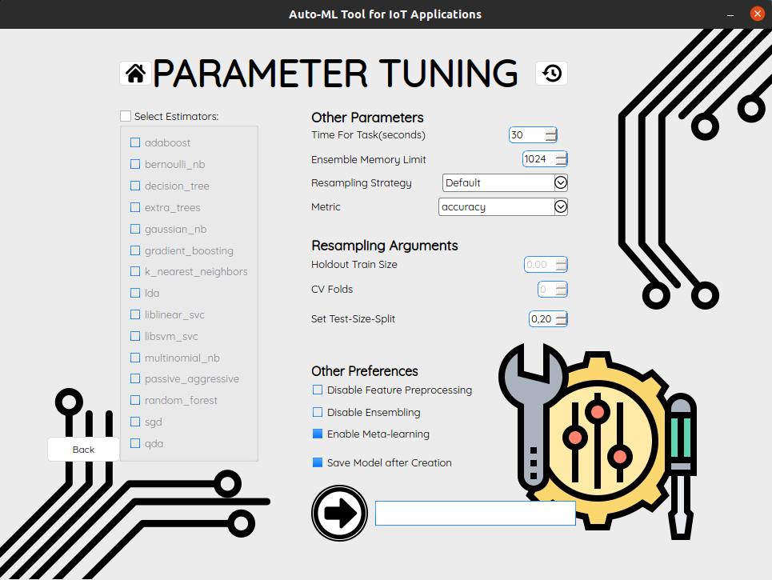

# WELCOME TO THE DALTON PROJECT

## ABSTRACT

Machine learning processes require expertise, time and resources in order to
successfully produce efficient models. Automated machine learning (AutoML)
is an innovative field of computer science which removes the human factor
from time consuming machine learning processes making it easier to create
computational models. 

In this diploma thesis, an automated machine learning
tool for IoT applications was designed and developed. The developed tool is an
easy-to-use, user-friendly computer application that aims to further facilitate
experienced users in implementing machine learning processes, but mainly to
make Machine Learning accessible to non-experienced people. 

The application
was implemented in Python and it is based on the Python library ”auto-sklearn”,
through which it implements the process of creating machine learning models,
which is its main function. Secondary functions of the application are the
conversion of timeseries problems into classical machine learning problems, the
extraction of features from timeseries data sets, the export of models supported
by microcontrollers, the storage of the generated models for retrieval and reuse.
Additionally, via the PyQt library, the graphical user interface of the application
was implemented for an easy navigation by unexperienced users. 

We consider
that the research, the achievement of all the objectives which were set during the
initial design of the application and the final tool are an important contribution
in the field of Automated Machine Learning, making it accessible to more people.  
Key Words: AutoML, automated machine learning, software, application,
autosklearn
3

## SUPPORTED FEATURES

All the supported features below are available via the User Interface of the application. 

  - Select and import your csv file from your file system or by providing the path to it.
  - Select your machine learning problem type between Classification, Regression or Time-series.
  - Select the target variable and the predictors in order to generate a new machine learning model with the help of autosklearn and more utilized libraries.
  - Generate multiple timesereies from single time- series data with the help of tsfresh.
  - Extract new features from multiple timeseries data and save the new dataset in a csv file for further usage.
  - Transform Timeseries problems into classic Regression or Classification problems.
  - Forecast future values in a desired time range.
  - Tune parameters and preferences for the generation of new machine learning models.
  - Save generated models in an SQLite database.
  - Preview saved models and related details.
  - Reuse save models on new datasets of the same structure.
  - Extract and save models locally using pickle.
  - Extract models for microcontroller usage (beta)

### PROJECT PREVIEW

  Welcome Screen            |  Import Data
:-------------------------:|:-------------------------:
  |   

Select Target Variable  |  Parameter Tuning
:-------------------------:|:-------------------------:
  |   

## USER'S GUIDE

### STEP 1: DOWNLOAD DALTON V 1.0

Just click <a href="https://bit.ly/35JSgOe"> this link</a> or scan the below QR code and navigate to the dropbox project folder to download version 1.0 of the DALTON application.

### STEP 2: INSTALLATION
- Extract the contents of the "DALTON_VERSION_1.7z" compressed file.
- Open the extracted folder and navigate to dist/DALTON folder.
- Right click inside dist/DALTON and select "open in Terminal".
- Run the command: `./DALTON` to execute the application.

In case you encounter an error looking like this:  

`ImportError: libcblas.so.3: cannot open shared object file: No such file or directory`

you may miss some dependencies, so please visit <a href="https://stackoverflow.com/questions/53347759/importerror-libcblas-so-3-cannot-open-shared-object-file-no-such-file-or-dire">this solution</a> thread.

## DEVELOPER'S GUIDE

### Install Miniconda / Activate new environment

`$ bash Miniconda3-latest-Linux-x86_64.sh`

`$ conda --version`

`$ conda create -n my_env`

`$ conda activate my_env`

### Install Python 3

`$ conda install python=3.8`

### Install auto-sklearn

`$ sudo apt install curl`

`$ sudo apt-get install build-essential`

`$ curl https://raw.githubusercontent.com/automl/auto-sklearn/master/requirements.txt | xargs -n 1 -L 1 pip3 install`

`$ pip3 install auto-sklearn`

`$ conda list`

### Install PyQt5

`$ conda install -c anaconda pyqt`

### Install SQLite

`$ conda install -c conda-forge sqlite`

`$ sudo apt-get install sqlitebrowser`

### Install tsfresh

`$ conda install -c conda-forge tsfresh`

### Install micromlgen

`$ pip install micromlgen`

### Run application

`$ cd <path-to-app-folder>`

`$ python app.py`

### Create executable file of the application

`$ conda install -c conda-forge pyinstaller`

Install scipy 1.4.1 to avoid dependency errors.

`$ conda install scipy=1.4.1`

`$ pip3 install opencv-python`

`$ sudo apt-get install libhdf5-dev`

`$ sudo apt-get install libhdf5-serial-dev`

`$ sudo apt-get install libatlas-base-dev`

Create executable file:
`$ pyinstaller -w --add-data "models.db:." DALTON.py`

Modify the generated DALTON.spec file to include all necessary files like databases, themes, images and fonts. 
Add the below code in the data field of the spec file.

`datas=[('models.db', '.'),
('theme.qss', '.'),
('./img/*.png', 'img'),
('./Font_fold/*.ttf', 'Font_fold')
],`

Then run this command to create executable:

`pyinstaller DALTON.spec`

The executable file is now inside the "dist/DALTON "folder by the name "DALTON".

## DEVELOPER'S GUIDE EXTRAS

### How to export a virtual environment

`$ conda env export > environment.yml`

### How to create a miniconda environment from a generated yml file.

Create environment: 
`$ conda env create -f environment.yml`

Install extra packages

`$ pip3 install auto-sklearn`

`$ pip3 install auto-sklearn`

`$ pip3 install micromlgen`

Run the application:
`$ python DALTON.py`

## REQUIREMENTS

|   Requirements	|   	|
|---	|---	|
|   OS 	|   Linux Ubuntu |
|   Python Version	| 3.8  	|
|   	Compiler |    GCC - C++ Compiler with C++ 11 support	|
|   SWIG Version	| 3.\*.\* (version>4.0.0 are not supported) 	|

## LIST OF PACKAGES

`_libgcc_mutex=0.1=main`

`auto-sklearn=0.12.6=pypi_0`

`bokeh=2.3.1=py38h578d9bd_0`

`brotlipy=0.7.0=py38h8df0ef7_1001`

`ca-certificates=2020.12.5=ha878542_0`

`certifi=2020.12.5=py38h578d9bd_1`

`cffi=1.14.5=py38h261ae71_0`

`chardet=4.0.0=py38h578d9bd_1`

`click=7.1.2=pyh9f0ad1d_0`

`cloudpickle=1.6.0=py_0`

`configspace=0.4.18=pypi_0`

`cryptography=3.4.7=py38ha5dfef3_0`

`cython=0.29.23=pypi_0`

`cytoolz=0.11.0=py38h25fe258_1`

`dask=2021.4.1=pyhd8ed1ab_0`

`dask-core=2021.4.1=pyhd8ed1ab_0`

`dbus=1.13.18=hb2f20db_0`

`distributed=2021.4.1=py38h578d9bd_0`

`expat=2.2.10=he6710b0_2`

`fontconfig=2.13.0=h9420a91_0`

`freetype=2.10.4=h5ab3b9f_0`

`fsspec=2021.4.0=pyhd8ed1ab_0`

`glib=2.56.2=hd408876_0`

`gst-plugins-base=1.14.0=hbbd80ab_1`

`gstreamer=1.14.0=hb453b48_1`

`heapdict=1.0.1=py_0`

`icu=58.2=he6710b0_3`

`idna=2.10=pyh9f0ad1d_0`

`jinja2=2.11.3=pyh44b312d_0`

`joblib=1.0.1=pyhd8ed1ab_0`

`jpeg=9b=habf39ab_1`

`lazy-import=0.2.2=pypi_0`

`ld_impl_linux-64=2.33.1=h53a641e_7`

`liac-arff=2.5.0=pypi_0`

`libblas=3.9.0=8_openblas`

`libcblas=3.9.0=8_openblas`

`libffi=3.3=he6710b0_2`

`libgcc-ng=9.1.0=hdf63c60_0`

`libgfortran-ng=7.5.0=h14aa051_19`

`libgfortran4=7.5.0=h14aa051_19`

`liblapack=3.9.0=8_openblas`

`libopenblas=0.3.12=pthreads_hb3c22a3_1`

`libpng=1.6.37=hbc83047_0`

`libstdcxx-ng=9.1.0=hdf63c60_0`

`libtiff=4.1.0=h2733197_1`

`libuuid=1.0.3=h1bed415_2`

`libxcb=1.14=h7b6447c_0`

`libxml2=2.9.10=hb55368b_3`

`locket=0.2.0=py38_1`

`lz4-c=1.9.2=he1b5a44_3`

`markupsafe=1.1.1=py38h8df0ef7_2`

`micromlgen=1.1.23=pypi_0`

`msgpack-python=1.0.0=py38h82cb98a_2`

`ncurses=6.2=he6710b0_1`

`numpy=1.19.4=py38hf0fd68c_1`

`olefile=0.46=pyh9f0ad1d_1`

`openssl=1.1.1k=h27cfd23_0`

`packaging=20.9=pyh44b312d_0`

`pandas=1.1.3=py38he6710b0_0`

`partd=1.2.0=pyhd8ed1ab_0`

`patsy=0.5.1=py_0`

`pcre=8.44=he6710b0_0`

`pillow=7.1.2=py38hb39fc2d_0`

`pip=21.0.1=py38h06a4308_0`

`psutil=5.7.2=py38h7b6447c_0`

`pycparser=2.20=pyh9f0ad1d_2`

`pynisher=0.6.4=pypi_0`

`pyopenssl=20.0.1=pyhd8ed1ab_0`

`pyparsing=2.4.7=pyh9f0ad1d_0`

`pyqt=5.9.2=py38h05f1152_4`

`pyrfr=0.8.2=pypi_0`

`pysocks=1.7.1=py38h578d9bd_3`

`python=3.8.8=hdb3f193_5`

`python-dateutil=2.8.1=py_0`

`python_abi=3.8=1_cp38`

`pytz=2021.1=pyhd8ed1ab_0`

`pyyaml=5.3.1=py38h7b6447c_1`

`qt=5.9.7=h5867ecd_1`

`readline=8.1=h27cfd23_0`

`requests=2.25.1=pyhd3deb0d_0`

`scikit-learn=0.24.2=pypi_0`

`scipy=1.5.3=py38h828c644_0`

`setuptools=52.0.0=py38h06a4308_0`

`sip=4.19.24=py38he6710b0_0`

`six=1.15.0=pyh9f0ad1d_0`

`smac=0.13.1=pypi_0`

`sortedcontainers=2.3.0=pyhd8ed1ab_0`

`sqlite=3.35.4=hdfb4753_0`

`statsmodels=0.12.1=py38h0b5ebd8_1`

`tblib=1.7.0=pyhd8ed1ab_0`

`threadpoolctl=2.1.0=pyh5ca1d4c_0`

`tk=8.6.10=hbc83047_0`

`toolz=0.11.1=py_0`

`tornado=6.1=py38h25fe258_0`

`tqdm=4.60.0=pyhd8ed1ab_0

`tsfresh=0.17.0=py_0

`typing_extensions=3.7.4.3=py_0

`urllib3=1.26.4=pyhd8ed1ab_0

`wheel=0.36.2=pyhd3eb1b0_0

`xz=5.2.5=h7b6447c_0

`yaml=0.2.5=h516909a_0

`zict=2.0.0=py_0

`zlib=1.2.11=h7b6447c_3

`zstd=1.4.5=h6597ccf_2 `

